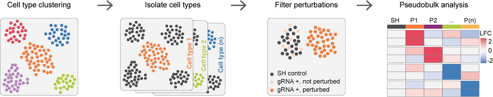

**Libraries**
```{r message=FALSE, warning=FALSE}
library(ggplot2)
library(dplyr)
library(Seurat)
library(DoubletFinder)
library(metap)
library(DropSeq.util)
library(dplyr)
library(tibble)
library(edgeR)
library(stringi)
library(ComplexHeatmap)
library(SingleCellExperiment)
library(destiny)
library(tidyr)
library(tidymv)
```


**Load functions**
```{r}
source("plot_functions.R")
source("dif.exp_functions.R")
```


**Load data**
```{r}
# Single cell object
seuset <- readRDS(file = "data/pooled_screen_CBh.rds")

# Keep only cells with MOI = 1
keep <- seuset$Barcode[!is.na(seuset$per_gene)]

seuset <- subset(seuset, subset = Barcode %in% keep)

# Define perturbations
perturbations <- unique(seuset$per_gene[!seuset$per_gene %in% "Safe_H"])

```




**Label non-perturbed cells with LDA filtering**
```{r message=FALSE, warning=FALSE}
seuset <- detectPerturbations(data = seuset,
                             ct_column = "cell_types_broad",
                             cell_types = c("Interneurons"), #cell_types = c("Supp_layer_neurons", "Deep_layer_neurons", "Interneurons", "Astrocytes", "Oligodendrocytes", "Microglia"),
                             pert_column = "per_gene",
                             ctrl_cond = "Safe_H",
                             perturbations = c("Dgcr8", "Dgcr14", "Ufd1l", "Gnb1l"), #perturbations = perturbations
                             min_de_genes = 5,
                             max_de_genes = 50)

# DE results are stored in the seurat object for later use (seuset@tools)
```


**Create pseudoBulk profiles**
```{r}
# Calculate pseudoBulks
bulk_screen <- list()
for (i in c("Interneurons")){ #c("Supp_layer_neurons", "Deep_layer_neurons", "Interneurons")
  # Define genes to keep based on average expression
  avg_exp <- rowMeans(seuset@assays$RNA@data[,colnames(seuset@assays$RNA@data) %in% rownames(seuset@meta.data[seuset$cell_types_broad == i & seuset$per_gene == "Safe_H",])])
  avg_exp <- avg_exp[avg_exp > 0.25] #Keep only genes with log1p(umi count) > 0.25 in the control condition
  avg_exp <- data.frame(avg_exp)
  avg_exp$gene <- rownames(avg_exp)
  
  # Calculate bulk profile
  bulk <- pseudoBulk_screen(object = seuset,
                       assay = "counts",
                       ct_col_meta = "cell_types_broad",
                       cell_type = i,
                       sample_meta = "lane",
                       perturbation_col_meta = "new_label",
                       perturb_info = c("Safe_H", "Dgcr8_KO", "Dgcr14_KO", "Ufd1l_KO", "Gnb1l_KO"),
                       min_features = 0)
  
  # Filter genes by avg expression and add avg exp data
  bulk <- bulk[avg_exp$gene,]
  
  bulk_screen[[i]] <- bulk
}
```


**Calculate DE genes**
```{r}
deg_bulk <- list()
deg_long <- data.frame()
for (i in c("Interneurons")){ #c("Supp_layer_neurons", "Deep_layer_neurons", "Interneurons")
  # Prepare metadata
  meta <- data.frame(pseudobulk = colnames(bulk_screen[[i]]),
                     umi_count = colSums(bulk_screen[[i]]))
  meta$per_gene <- gsub("\\:.*", "", meta$pseudobulk)
  meta <- within(meta, per_gene <- relevel(as.factor(per_gene), ref = "Safe"))
  
  for (y in c("Dgcr8_KO", "Dgcr14_KO", "Ufd1l_KO", "Gnb1l_KO")){
    deg <- pseudoDE(counts = bulk_screen[[i]],
                metadata = meta,
                groups = y,
                de_test = "edgeR",
                de_subtest = "LRT")
    
    deg_bulk[[i]][[y]] <- deg
    
    deg$cell_type <- i
    deg$perturbation <- y
    
    deg_long <- rbind(deg_long, deg)
  }
}

deg_long$condition <- paste(deg_long$cell_type, deg_long$perturbation, sep = ":")
```


**UMAP representation of perturbed cells**
```{r}
umap_coord_pert <- list()

ct <- "Interneurons" #c("Supp_layer_neurons", "Deep_layer_neurons", "Interneurons")

# Define genes for UMAP plot
genes_umap <- deg_long %>% group_by(perturbation) %>%  filter(cell_type == ct & logFC > 0.5 & FDR < 0.05) %>% top_n(-20, FDR)
genes_umap <- unique(genes_umap$gene)

deg_genes <- deg_long %>% group_by(perturbation) %>%  filter(cell_type == ct & abs(logFC) > 0.5 & FDR < 0.05)
deg_genes <- deg_genes$gene 


d2_viz <- umap_perturbations(object = seuset,
                             assay = "scale.data",
                             ct_col_meta = "cell_types_broad",
                             cell_type = ct,
                             perturbation_col_meta = "new_label",
                             perturbations = c("Safe_H", "Dgcr8_KO", "Dgcr14_KO", "Ufd1l_KO", "Gnb1l_KO"),
                             features = genes_umap,
                             total_deg = deg_genes, 
                             n_neighbors = 10,
                             spread = 10,
                             min_dist = 5)

umap_coord_pert[[ct]] <- d2_viz

ggplot(umap_coord_pert[[ct]], aes(x = umap_x, y = umap_y, color = new_label)) + geom_point() + plot_def_no_axis() +
  scale_color_manual(values = c("Safe_H" = "#D1D2D2", "Dgcr8_KO" = "#E2485F", "Dgcr14_KO" = "#437DB8", "Ufd1l_KO" = "#882E76", "Gnb1l_KO" = "#F8B650"))
```

